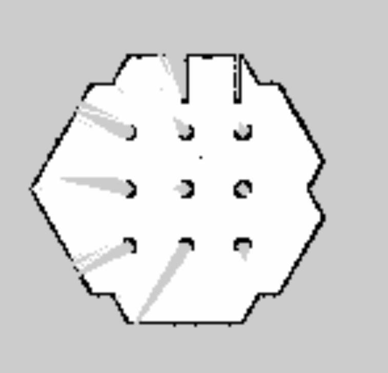

# PDE4430 Coursework2
## Introduction

In this coursework the student is supposed to create a mobile robot capable of delivering spheres
randomly positioned in the Gazebo simulated world from pick up point to a pen where the spehres
are supposed to be stored. The Gazebo world is already provided and student was needed to 
create the `URDF` file for the robot and required configuration files along with 
additional `ros` nodes. The following were the main tasks focussed on in order to meet the
requirements of the coursework.

- Setting up Gazebo environment with provided `assessment_world.launch` and `objects.lauch` to pupulate speheres randomly. 
- Creating the URDF file for the robot model with capabiliy of interacting with spheres.
- Creating required gazebo related configuration files and URDF tags to bring the robot in to assessment_world. 
- Using Hector Slam package to create the map of the environment to be used in autonamous navigation


## Guide to setup robot and assessment_world
The created robot can be viewed in rviz without having to open Gazebo which takes a
bit of time load. To speed up the process, a separate launch file is created to open the `URDF` file
in `RViz`. The main `ros` package which holds all the files of the robot is `snatcher`.

- The following command can be used to view the robot model in `RViz`

```bash
roslaunch snatcher snatcher_rviz.launch
```

- To view only the robot in gazebo with out assessment_world, the following command can be used.
```bash
roslaunch snatcher snatchert_gazebo.launch
```

- To view the robot in the assessment_world, use following command.
```bash
roslaunch snatcher snatcher_gazebo_world.launch
```

## Robot Development approach


### Robot Type
To keep the development procedure simple, it was decided to build a differential drive
robot. To handle the spehers the robot will use the cavity in its main body. This 
allows to further simplify the development of the robot while making it capable of 
achieving the goals.

### Handling Spheres
The current design uses its body cavity to engulf the sphere in to it and move 
arund by rolling it on the floor. To make it possible to roll the sphere on the ground, the 
main body doesn't have floor panel. To stop the spehers rolling out when the robot stops,
2 door panels are attached to the body which will stay closed when moving the spheres.


### Dimentions of the robot
The dimentions of the robot had to be calculated before designing to make sure the model
is capable of navigating in side the assessment_world and is capable of handling spheres.
By going through the `.sdf` files in the `assessment_world` package, the diameter of the largest sphere is found out to be 0.3 meters.
The width of the robot is then decided as 0.35 meters excuding the width of the wheels.

### URDF File Development
The initial structure of the robot was developed using without xacro. This gave and initial
idea about how the `URDF` tags work. Once the initial design is done, the files was converted
in to xacro section by section which in the end, made it easy to do changes for the robot model.

#### URDF tags
It was noted that the `URDF` file can be visualized with `<visual>` tag and `<collision>` tag in the links
in `RViz`. But in order to visualize the model in gazebo, each link should contain `<inertia>` tags. If the `<inertia>`
tag is ommited, the respective link will not be visible in Gazebo. 

The intertia has to calculated for each link. The required equations can be found on 
wikipidea. link is given below. The inertia tensors depends mainly on the weight and
 shape.

https://en.wikipedia.org/wiki/List_of_moments_of_inertia

For this robot the main body is considered as a cube, and wheels are considered as cylinders.

#### Joints of the robot
The joints between the robot body and the 2 wheels are set to continuous. 
The caster wheels are attached to the body via fixed joint but works as a support 
for the body as they dont have friction.
The door panales are fixed to the body as revolute joints.


#### Finding XACRO errors
When trying to visualize the URDF usually the errors are printed on the terminal.
But to check whether the joint heirachy is correct, the following command was used,

```bash
check_urdf << xacro filename.xacro
```
This `xacro` command converts xacro file in to a `URDF` file and pipes it in to `check_urdf` command which prints the joint heirachy on the terminal according to the URDF content.


#### Visual appearance in RViz and Gazebo
The `<color>` tag which is under the `<visual>` tag is used when it is viewed in 
`RViz`. The model will assigned with gray color material when viewed in `Gazebo`.
To assign colors for the links when viewed in the Gazebo, following snippet can be used 
in robot description.

```bash
  <gazebo reference="link_name">
    <material>Gazebo/DarkGrey</material>
  </gazebo>
```

More color can be found via this link: http://wiki.ros.org/simulator_gazebo/Tutorials/ListOfMaterials


### Sensors
The robot is equipped with a lidar sensor so that it can generate a map of the environment. This is useful when implementing autonamous navigation in the robot. Once the robot has the map, in order to identify the objects around while moving, the same Lidar can be used. In this robot model, the same Lidar available on the turtlebot3 robot is used.


##Moving the robot in gazebo environment
In order to send velocity commands to the robot, the same teleop node available with the turtlebot3 can be used as it publishes twist messages to `/cmd_vel` topic.
following command can be used to bring the turtlebot3_teleop node.

```bash
    rosrun turtlebot3_teleop turtlebot3_teleop_key 
```
As an alternative 'teleop_twist_keyboard.py' from 'teleop_twist_keyboard' package also can be used to control the robot. The <rempam> tag can be used to remap the topic to publish velocity commands if the robot uses a different namespace. Having different name spaces is usefull if multiple instances of the same robot exist in the same environment and needs to control only a single robot.

```bash
  <node name="teleop" pkg="teleop_twist_keyboard" type="teleop_twist_keyboard.py" output="screen">
    <remap from="/cmd_vel" to="<namespace>/cmd_vel"/>
  </node>
```
to run the node directly without a launch file while using default settings, the following command can be used,

```bash
  rosrun teleop_twist_keyboard teleop_twist_keyboard.py
```


## RViz
RViz is a visualizing software which can be used to visualize data in computational forms.
This is specially useful to understand the data being published in to different topics at the same time.
In this coursework, this tool is used to visualize topics such as `/odom`,`/tf`,`/scan`,`/robot_description`. 


## Gazebo
Gazebo is a simulator which can be used to simulate real world. This is useful
when testing the programs of the robots without having to taking the 
risk of accidents.

### Visuallizing robot in Gazebo with ROS integration
The URDF file alone is not enough to spwn the robot in gazebo and to control the robot via ROS. The `<gazebo>` tags in the `URDF` file are responsible for defining the physical properties of the links. 2 gazebo plugins are being used for in the robot model. `libgazebo_ros_diff_drive.so` to define the propertes of differential drve robot and `libgazebo_ros_laser.so` for the laser scanner. These plugins should given with several properties that they need these information to simulate what they are supposed to. For example, the differential drive robot plugin should be provided with the information like diameter of the wheel, distance between the wheels, wheel torque, topic that needs to subscribe in order to receive commands, etc. Similarly for scanner properties like the topic it needs to publish scab data and the frame of the scanner. The scanner frame which is defined in the xacro holds the parameters of the Lidar scanner such as the range, number of samples to be taken, resolution, sensor noise, etc


##Process automation attempt
The attempt was to automate the process of moving the spehers from their intial location to the pen.

### Creating a map for autonamous navigation
A map of the world is required for autonamous path planning. Once the robot has a map, it can localize it self in the environment. Once it is localized the robot can plan its path from current location to a different location. In this coursework, once the sphere is snatched, robot should be able to move to the pen area autonomously 


#### SLAM Algorithm
Since the robot is only equipped with a LIDAR, Hector Slam is selected to generate the map of the environment and localize as Hector SLAM algorithms use only scanner data to generate the map and to localize itself in the environment.




With the help of hector and teleop nodes, the robot can be moved around in the environment and the map can be generated. The map generation process
is viewed in the RViz when Hector slam tutorial launch file is launched.

The following command can be used to start generating the map.

```bash
    roslaunch hector_slam_launch tutorial.launch 
```


To save the generated map, following command can be used

```bash
    rosrun map_server map_saver -f map_save_name.yaml
```


## Snatching accuracy of spheres in the assignment_world
Run the launch file to open assignment_world with the snatcher robot in it.
Once it is loaded, turtlebot3_teleop_key cn be used in order to move the robot.

The robot can successfully bring the spheres in to the body cavity without any collisions. This is because the collision tags parameters are similar to the visual tag parameters. What is visible of the robot is also the collision regions. the smalle sphere doesn't toll under the panels as the gap between ground and panel is smaller than the diameter of the sphere.


Despite not having door panels in the Gazebo simulation to stop the spheres rolling out, with precise
 movements of the robot, the spheres can be brought in to the pen as shown in the end of the demonstration video.
 
Note: The door panels were removed in the Gazebo simulation as they were not properly configured and blocking the spheres rolling in to the cavity.


## Author

- [@tharindurm](https://github.com/tharindurm) M00909166 - TP549@live.mdx.ac.lk
- [Demo video](https://youtu.be/KxmCMbViGs8) - Youtube Link


## References
- URDF tutorials : [http://wiki.ros.org/urdf/Tutorials](http://wiki.ros.org/urdf/Tutorials)
- Differential drive robot tutorial : [Create-a-mobile-robot-model-with-ros-urdf](https://medium.com/teamarimac/create-a-mobile-robot-model-with-ros-urdf-4dc46446db7f)
- Differential drive robot tutorials : [Autonamous navigation with differential drive robots](https://kiranpalla.com/autonomous-navigation-ros-differential-drive-robot-simulation/simple-navigation-with-differential-drive-plugin/)
